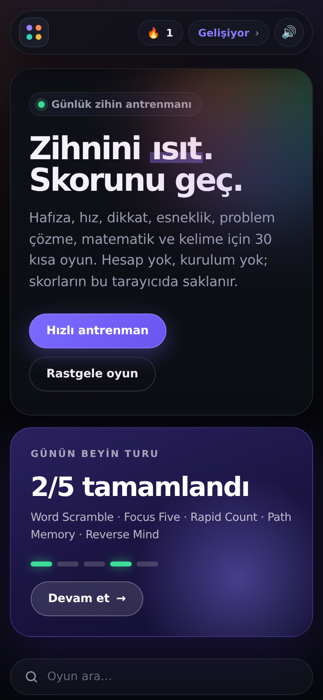
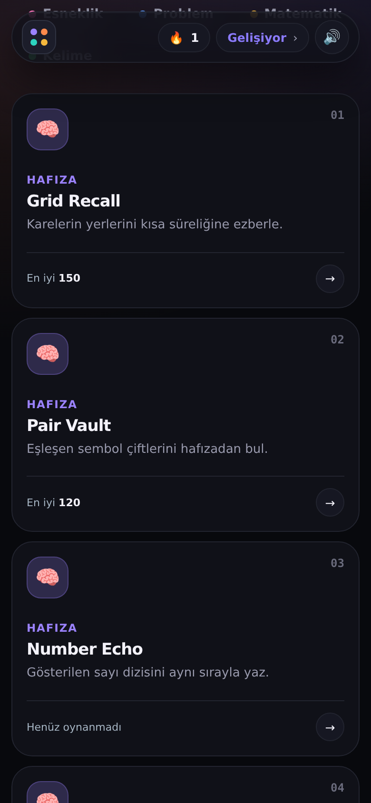
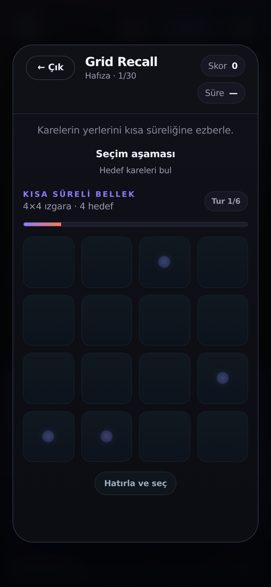
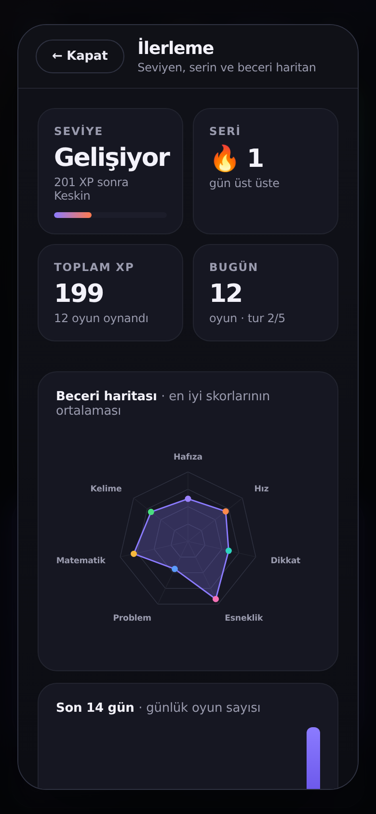

# NEUROARCADE

**7 beyin alanında 30 zihin oyunu.** Siyah temalı, telefonda ve bilgisayarda çalışan, çevrimdışı kullanılabilen bir tarayıcı uygulaması.

Hafıza, hız, dikkat, esneklik, problem çözme, matematik ve kelime becerilerini kısa oyunlarla çalıştırır. Hesap, reklam ve takip yoktur; tüm veriler tarayıcıda saklanır.

## Ekranlar

<p>
  
  
  
  
</p>

## Özellikler

- Siyah tema; göz yormayan, yüksek kontrastlı arayüz
- 7 kategori filtresi ve oyun arama
- Her gün değişen 5 oyunluk **Günün Beyin Turu** ("Sıradaki oyun →" ile sırayla oynanır)
- Gün serisi 🔥 ve seviyeler: Çaylak → Gelişiyor → Keskin → Usta → Dahi
- **İlerleme ekranı:** beceri haritası (radar grafik), son 14 günlük etkinlik, rekorlar
- Doğru/yanlış/bitiş sesleri ve titreşim (üst bardan kapatılabilir)
- İnternetsiz çalışma (servis çalışanı), ana ekrana eklenebilir (PWA)
- Mobil uyumlu: 4 → 3 → 2 → 1 sütun, `prefers-reduced-motion` desteği
- Hesap, reklam ve takip yok; tüm veriler cihazda
- Çalışma zamanı kütüphanesi veya derleme adımı gerektirmez

## Oyunlar

| Alan       | Oyunlar                                                                     |
| ---------- | --------------------------------------------------------------------------- |
| Hafıza     | Grid Recall, Pair Vault, Number Echo, Path Memory, Symbol Snapshot, Color Sequence |
| Hız        | Quick Tap, Speed Match, Target Hunt, Rapid Count, Symbol Sprint, Reaction Lane |
| Dikkat     | Odd One, Color Filter, Focus Five, Train Switch, No-Go Tap, Split Focus     |
| Esneklik   | Rule Shift, Direction Flip, Letter Number, Sort Shift, Reverse Mind, Pattern Swap |
| Problem    | Route Runner, Tile Rotate, Bridge Builder, Lights Logic                     |
| Matematik  | Math Blitz                                                                  |
| Kelime     | Word Scramble                                                               |

## Çalıştırma

Node.js 18+ gerekir.

```
npm start        # boş bir portta açar (varsayılan http://localhost:5173)
```

Windows'ta `start-dev.bat` dosyasına çift tıklayabilir ya da `index.html` dosyasını doğrudan tarayıcıda açabilirsin.

## Test

```
npm install
npx playwright install chromium
npm test
```

Test; sunucuyu başlatır, 30 oyunun hepsini açıp arenanın dolduğunu kontrol eder, Günün Turu'nu baştan sona oynar ve ilerleme ekranını dener. Konsolda ya da sayfada hata çıkarsa başarısız olur.

## Proje yapısı

```
index.html              Sayfa iskeleti
manifest.webmanifest    PWA tanımı
sw.js                   Çevrimdışı önbellek
icon.svg                Uygulama simgesi
server.mjs              Yerel geliştirme sunucusu
start-dev.bat           Windows için tek tıkla başlatma
src/
  main.js               Durum, oyunlar, günün turu, ilerleme, ses
  style.css             Kabuk tasarımı ve renk değişkenleri
  games.css             Oyun içi bileşenler
docs/screenshots/       README ekran görüntüleri
tests/smoke.mjs         Otomatik test
CHANGELOG.md            Sürüm notları
```

## Yayın

Proje statik olduğu için GitHub Pages ile doğrudan yayınlanır: depo ayarlarında **Settings → Pages → Deploy from a branch → `main` / `(root)`** seç.
